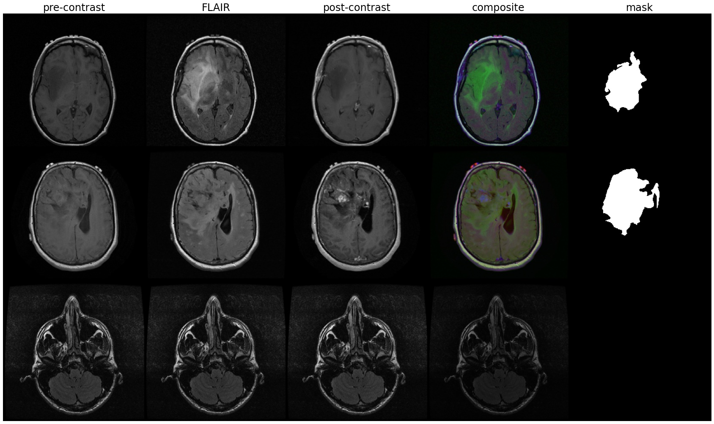

# Recurrent-Attention-UNets and Distributed Training Pipeline

In this repository, I've created thorough, extensible implementations of a couple foundational U-Net papers in vanilla PyTorch. As a learning exercise, I attempted this with only the papers' written contents as reference. The repository includes the application of ideas like **soft-attention decoder gates**, **recurrent convolutional blocks** and **residual skip gates** for enhanced U-Net training and inference.

I also present an approach for multi-process **Distributed Data-Parallel** (**DDP**) training and **cloud TPU** acceleration. 

Fluid-Attenuated Inversion Recovery (FLAIR) **brain MRI segmentation** is used as an example task for U-Net deployment, with a custom pipeline for preprocessing, training and validation provided.


## Papers Implemented
1. [U-Net](https://arxiv.org/abs/1505.04597): Convolutional Networks for Biomedical Image Segmentation
2. [Attention U-Net](https://arxiv.org/abs/1804.03999):     Learning Where to Look for the Pancreas
3. [RU-Net and R2U-Net](https://arxiv.org/abs/1802.06955): Recurrent Residual Convolutional Neural Network based on U-Net for Medical Image Segmentation
4. [R2AU-Net](https://www.hindawi.com/journals/scn/2021/6625688/): Attention Recurrent Residual Convolutional Neural Network for Multimodal Medical Image Segmentation

## Brain MRI Segmentation
The [Lower-Grade Glioma Segmentation Dataset](https://www.kaggle.com/mateuszbuda/lgg-mri-segmentation) on Kaggle from Buda et al. contains brain MRI from 110 patients, with manual segmentation masks of gliomas. Some data samples are shown below.
<p align="left">

</p>

### Data Tools
The *data_tools* directory shows techniques to properly split the dataset by patient to avoid data leakage. It makes use of custom PyTorch Dataset and DataLoader classes for clean and optimized sample retrieval. 

I also devised a technique to stratify the split based on tumor progression (see *data_prep.py*).


### Stateful Sample Transforms
When working with a limited dataset, data augmentation is essential for regularization and usually enhances validation performance.

To the best of my knowledge, PyTorch does not provide a default API to perform stateful or stochastic transforms on image and masks together. Thus, I've provided a set of custom transform classes that are able to perform such operations on a sample's image and mask together.

### Loss Functions
Variants of the Sørensen–Dice coefficient-derived dice loss were chosen as the primary loss function. This is because of the **heavy class imbalance** present in this dataset. There are several slices which have no FLAIR abnormalities at all, implying a blank segementation map. This would greatly bias pixel-wise loss functions like cross-entropy loss. Thus, a function which is robust to class imbalance (weighted cross entropy, dice loss, etc.) is required.


Dice loss was originally proposed by [Milletari et al.](https://ieeexplore.ieee.org/stamp/stamp.jsp?tp=&arnumber=7785132) as follows, <br>
<p align='center'>

</p>
It sums over all N pixels, where p is obtained from the segmentation map and g from the ground truth binary mask.

For 2D images, a batch of B samples is collected into a single tensor of size (B x C x H x W). In many authors' implementations, a batch's dice loss is calculated as if we have a single image and mask, each with BCHW pixels. I suspect this is done due to ease of implementation, and it results in only minor deviations. Still, I have provided one which is true to the original dice loss formulation.

## Distributed Data Parallel (DDP) and Cloud TPUs
To enable Cloud TPU acceleration, simply run tpu_wheel_setup/prep.sh and set `config.params['device'] = 'tpu'`. Ensure that you are using an execution environment that supports PyTorch/XLA.

For distributed training, ddp/train_val_loop.py can be invoked with CLI arguments as follows,
```bash
$ python ddp/train_val_loop.py --nodes 8 --gpn 2 --nrank 0 --epochs 10
```
nodes = total nodes running DDP | gpn = GPUs per node | nrank = node rank | epochs = num epochs per process

Make sure to specify the address and port of the master process in config.params.
<p align='center'><br>A brief summary of how <a href="https://pytorch.org/docs/stable/notes/ddp.html">PyTorch DDP</a> functions</p>


